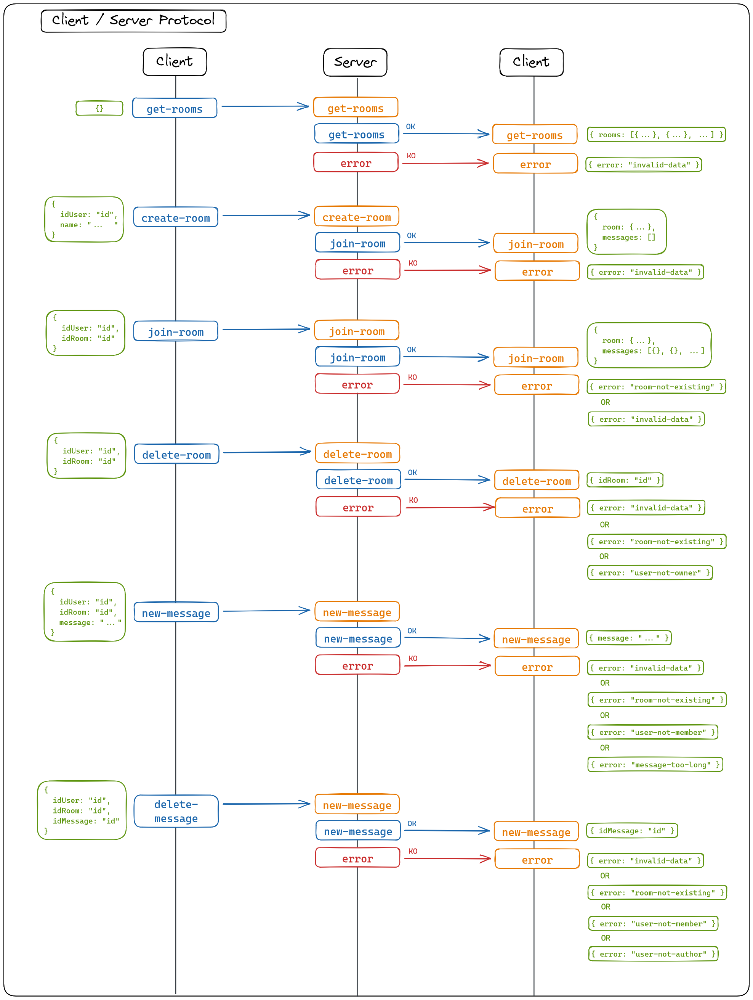

# Commands

## Docker Compose

If you want to start the service with Docker Compose, you just have to enter the command `docker compose up` at the root of the project.

## Local

If you want to start the service locally, you will need :

- node v18.8.0 or newer
- a redis server
- start the **Chat Filters** service

Next, you need to enter the following commands :

> `cd ./app`
>
> `npm install`

You can now enter the commands :

1. `npm run start` - Launch the application
2. `npm run test` - Launch the tests

# Client / Server Protocol

